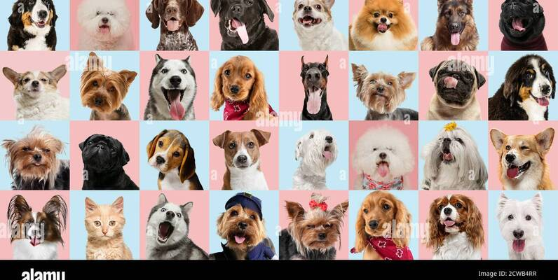
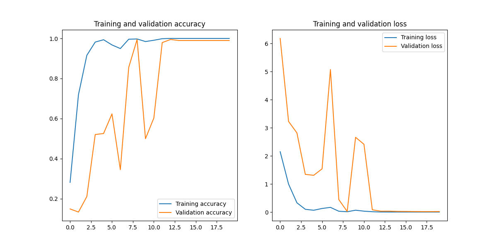

# Dog-Breed-Classification


## Project Overview
Classify common dog breeds using deep learning. The data set comes from the Kaggle public data set. The project was completed using keras3 and some other useful libraries.

## CNN Model
The project uses the lightweight CNN network ResNet18. For more information about this network, please refer to the paper: https://arxiv.org/abs/1512.03385.
Here are the details of the model:

|  Model   | Training Epochs | Accuracy on Test Dataset | Trained Model   |
| :------: | --------------- | ------------------------ | --------------- |
| resnet18 | 20              | 99%                      | dog_breed.keras |



**Please note: Since this model is easy to train, I did not upload the trained model to GitHub.**

<h2>Installation and Workflow</h2>

<h3>1.Installation</h3>

<ul>
    <li>The model is trained using GPU, so it is best to ensure that your code can run in a GPU environment.</li>
    <li>Keras3 can use a variety of backend computing libraries. Here I chose PyTorch, so you need to install the GPU version of PyTorch (already integrated in the requirements.txt file).</li>
    <li>Execute `pip install requirements.txt`</li>
</ul>

<h3>2. Dataset Preparation</h3>

Since the dataset is small, I have uploaded all the training images to GitHub and placed them in the dataset folder. You can use these images directly without downloading them from the Internet. Note: The dataset comes from kaggle: https://www.kaggle.com/datasets/khushikhushikhushi/dog-breed-image-dataset.

<h3>3. Model Training</h3>

Execute "model_test.py": `python model_test.py`

<h3>4. Model Evaluation</h3>

Execute "model_validation.py": `python model_eval.py`

<h3>5.Final Use Method</h3>

```sh
python main.py your_image_path
```

<h2>Final Effect</h2>

The results shown in the picture are run on Visual Studio Code:
