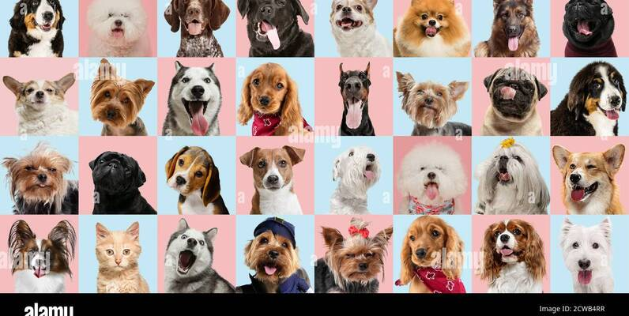

# Dog-Breed-Classification

## Project Overview
Classify common dog breeds using deep learning. The data set comes from the Kaggle public data set. The project was completed using keras3.

## CNN Model
The project uses the lightweight CNN network ResNet18. For more information about this network, please refer to the paper: https://arxiv.org/abs/1512.03385.